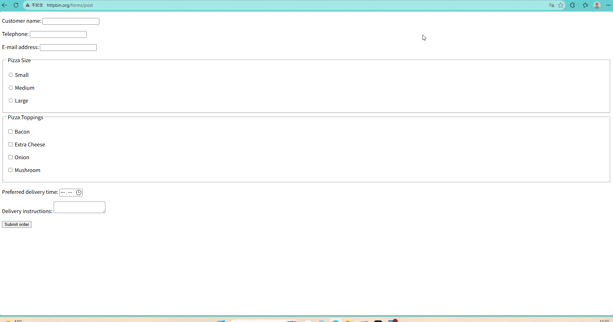

# 🤖 AutoPilot — AI 驱动的 Web + Android UI 自动化测试平台

> **"让测试回归业务，让 AI 搞定代码。"**
>
> 一个面向测试工程师与开发团队的轻量级、开箱即用的 AI 自动化测试助手。
> 核心理念：**先感知页面，再生成用例**。

> 🎯 **不是又一个 AI 测试框架，而是一个 Excel → 可执行脚本的转化器。**


## 一、项目定位

AutoPilot 是一个**环境感知型** AI UI 自动化测试平台，同时支持 **Web（Playwright）** 和 **Android（Appium）** 双平台。

传统 AI 生成脚本属于"盲猜式"——AI 不了解页面真实 DOM 结构，导致元素定位频繁失败。AutoPilot 在执行前先用 Playwright / Appium 抓取目标页面的**真实可交互元素**，将元素上下文与测试用例一并喂给 LLM，从而大幅提升首次生成准确率。

**一句话总结**：给 AI 装上"眼睛"，让它基于真实环境写代码，而不是凭空猜测。


## 二、市场定位：跟别人有什么不同？

| 对比维度 | browser-use | Playwright MCP | Bugninja AI | **AutoPilot** |
| :--- | :--- | :--- | :--- | :--- |
| **使用方式** | 写 Python 代码 | 写 Python 代码 | Web 界面（商业 SaaS） | **Web 界面（开源免费）** |
| **面向用户** | 开发者 | 开发者 | QA 团队 | **测试人员（含手工测试）** |
| **输入** | 自然语言指令 | 自然语言指令 | Excel/Word | **Excel 用例** |
| **输出** | AI 实时执行 | AI 实时执行 | 平台内部脚本 | **标准 .py 文件，可下载带走** |
| **平台支持** | Web | Web | 多平台 | **Web + Android** |
| **开源** | ✅ | ✅ | ❌ | ✅ |
| **中文场景优化** | 通用 | 通用 | 部分支持 | **✅ Excel 列名智能匹配** |

**差异化壁垒：**

1. **形态壁垒**：Web 平台 vs 命令行库——测试人员不需要懂 Python
2. **场景壁垒**：Excel 用例转化 vs 自然语言执行——贴合国内测试团队实际工作流
3. **输出壁垒**：生成标准 `.py` 文件——用户不被平台锁定，可自由接入 CI/CD
4. **平台壁垒**：同时支持 Web + Android，统一管理入口


## 三、解决什么问题

| 痛点 | 传统方案 | AutoPilot 方案 |
| :--- | :--- | :--- |
| **编写门槛高** | 要求测试人员具备编程能力 | 零代码，Excel 导入即可生成脚本 |
| **维护成本大** | 前端迭代导致定位器失效，维护占 60%+ 工时 | 智能元素抓取 + 执行容错重试 + AI 自愈，降低维护开销 |
| **用例转化难** | Excel 用例需人工逐条翻译为代码 | 批量导入，AI 自动转化为 Playwright / Appium 代码 |
| **AI 生成不稳定** | 纯自然语言生成，缺乏页面结构上下文 | **环境感知 → 精准生成**，准确率提升显著 |
| **多平台覆盖** | 需独立维护 Web / Android 两套自动化 | 统一平台管理，共享用例、报告、自愈能力 |


## 四、核心业务闭环

AutoPilot 构建了完整的自动化工作流，支持 Web 和 Android 双平台：

```
环境配置 → 元素抓取 → 用例导入 → AI 精准生成 → 可视化执行 → [失败时自愈修复] → 报告输出
```

| 步骤 | Web | Android |
| :--- | :--- | :--- |
| **1. 环境配置** | 输入目标 URL，选择浏览器类型 | 输入 Appium 配置（server、package、activity、device） |
| **2. 智能元素抓取** | Playwright 自动遍历页面，提取所有可交互元素；**goto 失败时 AI 感知导航**（截图分析 → 自动执行前置操作） | Appium 自动遍历 Android 界面，提取元素（resource-id / content-desc / text / XPath） |
| **3. 用例导入** | 上传标准 Excel 测试用例，系统自动识别中英文列名，批量解析 | 与 Web 共享统一格式 |
| **4. AI 精准生成** | 将**真实元素列表** + **用例步骤**作为上下文，生成 Playwright 异步代码 | 生成 Appium 同步代码（链式调用风格），注入监控钩子 |
| **5. 可视化执行与监控** | 支持有头/无头模式运行，Web 界面实时展示执行进度、每步截图与完整日志 | 同步执行，每步截图（before/after），实时状态轮询 |
| **6. 执行容错与自愈** | 失败时自动截图、捕获错误日志，LLM 分析错误上下文，重新生成定位器 | 同步执行，LLM 分析异常类型（NoSuchElement / StaleElement / Timeout / WebDriver），针对性修复 |
| **7. 报告生成** | 自动生成离线 HTML 可视化报告，含通过率、失败详情、截图对比、日志追溯 | 统一报告格式，含平台标签、异常类型分析 |


## 五、产品能力

| 能力 | Web | Android |
| :--- | :--- | :--- |
| **元素定位策略** | 7 级降级（data-testid → id → name → placeholder → class → text → nth-child） | 5 级优先级（resource-id → content-desc → text → class+attributes → XPath） |
| **单条用例端到端耗时** | 标准用例 ≤ 60 秒 | 标准用例 ≤ 60 秒 |
| **Excel 批量导入** | 单次支持 100 行以上用例无丢失 | 与 Web 共享 |
| **执行模型** | 异步 `async def run_test(page)` | 同步 `def run_test(driver)` |
| **代码风格** | 标准 Playwright Python API | 链式调用 `driver.find_element(...).action()` |
| **监控注入** | AST 注入 `__monitor_before/after`（异步 await） | AST 注入 `__monitor_before/after`（同步，独立定义） |
| **自愈能力** | LLM 重新生成定位器 | LLM 分析异常类型，针对性修复 |
| **开源协议** | MIT | MIT |


## 六、技术栈

| 端 | 技术 |
| :--- | :--- |
| **后端** | FastAPI 0.115 · SQLAlchemy 2.0 · Pydantic 2.9 · Playwright 1.47 · Appium Python Client 4.2 · httpx 0.27 · openpyxl 3.1 · Jinja2 3.1 · Python 3.12+ |
| **前端** | Vue 3 · Vite 5 · Vue Router 4 · Pinia 2 · Element Plus 2.5 · Axios 1.7 · Highlight.js 11.9 |
| **数据库** | MySQL 8.0 |
| **测试** | pytest 7.4+ · pytest-asyncio · pytest-cov · pytest-mock · factory-boy · faker · freezegun |


## 七、项目结构

```
AutoPilot/
├── backend/                        # 后端服务（FastAPI）
│   ├── app/
│   │   ├── main.py                 # FastAPI 入口 + 生命周期
│   │   ├── config.py               # 配置加载（pydantic-settings 单例）
│   │   ├── dependencies.py         # 依赖注入（get_db 等）
│   │   ├── exceptions.py           # 全局异常处理器
│   │   ├── schemas.py              # Pydantic 响应模型（含 platform + config_json）
│   │   ├── db/                     # SQLAlchemy 引擎 + schema.sql
│   │   ├── models/                 # 9 个 ORM 模型（含 platform/selector_type/metadata/attempts）
│   │   ├── routers/                # 8 个 API 路由模块
│   │   ├── services/               # 10 个业务服务（含编排器、AppiumService、AndroidCrawlService）
│   │   ├── utils/                  # Excel 解析 / AST 校验 / 注入 / 截图 / Appium 代码注入
│   │   ├── prompts/                # AI Prompt 模板（代码生成/自愈/页面分析 共 5 个）
│   │   ├── templates/              # HTML 报告模板
│   │   └── middlewares/            # 请求日志 + 响应计时
│   ├── tests/                      # pytest 四层测试套件（780+ 测试）
│   │   ├── conftest.py             # 共享 Fixture（SQLite 内存库 + 全 Mock）
│   │   ├── factories.py            # 工厂类
│   │   ├── unit/                   # 单元测试
│   │   ├── services/               # 服务层测试
│   │   ├── routers/                # 路由层测试
│   │   └── integration/            # 端到端集成测试
│   ├── uploads/                    # 截图 / Excel / 视频
│   ├── reports/                    # HTML 报告（30 天自动清理）
│   ├── pytest.ini                  # pytest 配置
│   └── requirements.txt
└── frontend/                       # 前端管理界面（Vue 3）
    ├── src/
    │   ├── api/                    # 8 个 API 模块
    │   ├── components/             # 8 个公共组件
    │   ├── composables/            # 轮询 / WebSocket
    │   ├── stores/                 # 4 个 Pinia Store
    │   ├── router/                 # 路由配置
    │   ├── styles/                 # 全局样式
    │   └── views/                  # 视图页面
    ├── Dockerfile                  # 多阶段构建
    └── nginx.conf                  # 反向代理 + SPA 回退
```


## 八、项目价值

### 对个人开发者
- **面试核心竞争力**：展示全栈开发 + AI 工程化落地 + 测试工具产品设计的复合能力
- **开源作品集**：一个完整的、可运行的开源项目，是面试时最有力的技术信任背书
- **技术深度**：实践 Prompt Engineering、Playwright + Appium 自动化、异步 FastAPI、现代前端工程化
- **开源影响力**：为国内 "AI + 测试" 社区贡献可落地的轻量级方案

### 对团队与企业
- **降低门槛**：手工测试人员无需编程即可参与 UI 自动化
- **提升效率**：用例转化从"人工编写"变为"AI 精准生成"
- **减少维护**：元素抓取提升定位器稳定性，AI 自愈修复覆盖异常，降低脚本维护成本
- **统一管理**：Web + Android 双平台，一个入口统一管理


## 九、迭代路线图

| 版本 | 状态 | 核心内容 |
| :--- | :--- | :--- |
| **V1.0** | ✅ MVP 已发布 | 跑通"抓取 → 导入 → 生成 → 执行 → 容错重试 → 报告"全链路（Web 端） |
| **V1.1** | ✅ Core 已完成 | 新增 Android 支持（AppiumService、元素抓取、AI 生成、执行、自愈、监控）、Orchestrator 平台分发、Heal History、Report 增强、Project/PageElement 平台隔离、780+ 测试 |
| **V1.2** | 🔧 开发中 | AI 感知页面抓取（goto 失败自动截图分析并执行前置操作）、执行失败标记修复、自愈历史字段补全、执行列表平台信息、Excel 导入反馈增强、Heal History 可视化增强、Report Trend 趋势图 |


## 十、快速开始

### 效果演示

<p align="center">
  
</p>

### 前置条件

- Docker 20.10+（已内置 Docker Compose）

### 一键启动

```bash
# 克隆仓库
git clone https://gitee.com/Mr-6Lawrence/auto-pilot-test.git
cd auto-pilot-test

# 创建环境文件，填入你的 AI API Key
# （Windows 用户请手动创建 .env 文件）
cat > .env << 'EOF'
OPENAI_API_KEY=sk-your-key
OPENAI_BASE_URL=https://api.deepseek.com/v1
OPENAI_MODEL=deepseek-chat
EOF

docker compose up -d
```

首次构建约 5~8 分钟，完成后访问 `http://localhost:8080` 即可使用。

### 本地开发

```bash
# 后端（注意：禁止 --reload，避免沙箱拦截 Playwright）
cd backend
pip install -r requirements.txt
playwright install chromium
python -m uvicorn app.main:app --host 127.0.0.1 --port 8000

# 前端
cd frontend
npm install
npm run dev   # http://localhost:5173
```

### 运行测试

```bash
cd backend
pytest                              # 运行全部测试（含覆盖率）
pytest tests/unit/                  # 仅单元测试
pytest tests/services/              # 仅服务层测试
pytest tests/routers/               # 仅路由层测试
pytest tests/integration/           # 仅端到端集成测试
```

测试套件采用**四层架构**（unit / services / routers / integration），全部运行于 SQLite 内存数据库、零外部依赖：
- LLM API、Playwright、Appium、文件系统均通过 Mock 隔离
- 当前 **780 passed, 1 skipped**
- 完整说明见 [tests/README_TEST.md](backend/tests/README_TEST.md)

> 详细技术文档、API 接口、数据库设计请参阅：
> - [📁 后端文档](backend/README.md)
> - [📁 前端文档](frontend/README.md)


## 十一、贡献指南

欢迎 Star、Fork 与贡献代码！无论是 Prompt 优化、自愈策略改进，还是新功能模块，都期待你的参与。

如有问题，请提交 Issue 或联系维护者。


## 📄 开源许可

本项目基于 **MIT 许可证** 开源。


## 📌 版本信息

| 项目 | 内容 |
| :--- | :--- |
| **当前版本** | V1.2（开发中） |
| **文档版本** | V3.1 |
| **最后更新** | 2026-08-23 |
| **后端测试** | 780 passed / 1 skipped |
| **维护者** | ethan-peng（Mr-6Lawrence） |
| **Gitee** | https://gitee.com/Mr-6Lawrence/auto-pilot-test |
| **GitHub** | https://github.com/ZipUp-dot/AutoPilot-Test |